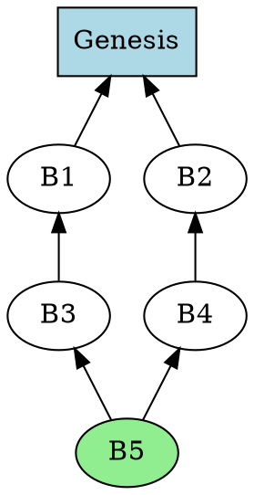

# Multi-Parent DAG Structure

## Overview

Casper CBC uses a **Directed Acyclic Graph (DAG)** structure instead of a traditional linear blockchain. This fundamental architectural choice provides significant advantages in throughput, concurrency, and flexibility, but also introduces unique challenges for consensus and finalization.

This document explains:
- What a DAG is and why it's used
- How it differs from linear blockchains
- Properties and implications
- Implementation details
- Trade-offs and design decisions

## Linear Blockchain vs. DAG

### Traditional Linear Blockchain

```
Genesis ← B1 ← B2 ← B3 ← B4 ← B5 ← B6
```

Properties:
- **Single parent**: Each block references exactly one parent
- **Total ordering**: All blocks are strictly ordered
- **Sequential**: Blocks must be created one after another
- **Simple finality**: Longest chain or explicit finality gadget

Limitations:
- **Low throughput**: One block at a time
- **Wasted work**: Competing blocks (forks) are discarded
- **Serialization**: Cannot process independent transactions in parallel

### Multi-Parent DAG

```
            ┌─── B5 ────┐
            │            │
Genesis ─── B1 ─── B3 ───┴─── B6
            │            ┌───┘
            └─── B2 ─────┘

Blocks:
B1: parent = Genesis
B2: parent = Genesis        (concurrent with B1)
B3: parent = B1
B5: parent = B1             (concurrent with B3)
B6: parents = [B3, B5, B2]  (merges three branches)
```

Properties:
- **Multiple parents**: Blocks can reference multiple parents
- **Partial ordering**: Some blocks are concurrent (unordered relative to each other)
- **Parallel creation**: Multiple validators propose simultaneously
- **Merge semantics**: Independent branches can combine

Advantages:
- **High throughput**: Many blocks created in parallel
- **Utilized work**: All valid blocks contribute to consensus
- **True concurrency**: Independent state changes execute in parallel
- **Flexible consensus**: Fork choice can optimize for various criteria

## DAG Structure in Casper CBC

### Block Parent Selection

**Not all justifications are parents:**

```rust
BlockMessage {
    justifications: [
        { validator: "alice", latestBlockHash: "hash_A5" },
        { validator: "bob",   latestBlockHash: "hash_B7" },
        { validator: "charlie", latestBlockHash: "hash_C3" },
    ],  // ← Declares knowledge of all validators

    header: {
        parent_hashes: ["hash_B7", "hash_C3"],  // ← Explicit parents (subset)
    }
}
```

**Why the difference?**

- **Justifications**: Declare what validator has seen (Byzantine fault detection)
- **Parents**: Declare what block explicitly builds on (state merging)

**Parent Selection Algorithm** (Fork Choice Estimator):

```
1. Score all blocks using justifications (validator weight)
2. Select top-K highest-scored blocks as parents
   where K is typically 1-5 (configurable)
```

See: [fork-choice-estimator.md](../02-consensus-protocol/fork-choice-estimator.md)

### DAG Properties

#### Property 1: Acyclic

**No cycles allowed:**

```
Valid DAG:
A → B → C
    ↓
    D

Invalid (has cycle):
A → B → C
    ↑   ↓
    └── D
```

**Enforcement**:
- Blocks include timestamps
- Parents must have earlier timestamps
- Block validation rejects cycles

**Implementation** (`/var/tmp/debug/f1r3node/casper/src/rust/interpreter/validate.rs`, lines 250-280):

```rust
fn validate_acyclic(
    block: &BlockMessage,
    dag: &BlockDagRepresentation,
) -> Result<(), ValidationError> {
    let block_timestamp = block.header.timestamp;

    for parent_hash in &block.header.parent_hashes {
        let parent = dag.get_block(parent_hash)?;

        if parent.header.timestamp >= block_timestamp {
            return Err(ValidationError::ViolatesAcyclicity);
        }
    }

    Ok(())
}
```

#### Property 2: Causal Ordering

**If A is an ancestor of B, events in A happened before events in B:**

```
A → B → C

Events in A must be processed before events in C
(transitively through B)
```

This enables:
- **Deterministic state transitions**: Process blocks in topological order
- **Replay capability**: Reconstruct state from any DAG subset
- **Conflict detection**: Identify conflicting state changes

#### Property 3: Partial Ordering

**Not all blocks are ordered relative to each other:**

```
    A
   / \
  B   C   ← B and C are concurrent (unordered)
   \ /
    D
```

Implications:
- **Parallel execution**: B and C can execute concurrently
- **Conflict resolution**: D must merge states from B and C
- **Commutative operations**: State changes should commute when possible

### DAG Representation in Memory

**Source**: `/var/tmp/debug/f1r3node/casper/src/rust/dag/block_dag.rs`

```rust
pub struct BlockDagRepresentation {
    // Block storage
    blocks: HashMap<BlockHash, BlockMessage>,

    // Parent-child relationships
    children: HashMap<BlockHash, Vec<BlockHash>>,
    parents: HashMap<BlockHash, Vec<BlockHash>>,

    // Latest messages from each validator
    latest_messages: HashMap<Validator, BlockHash>,

    // Equivocation tracking
    equivocations: HashMap<Validator, Vec<BlockHash>>,

    // Topological ordering cache
    heights: HashMap<BlockHash, u64>,
}

impl BlockDagRepresentation {
    pub fn add_block(&mut self, block: BlockMessage) -> Result<(), DagError> {
        let hash = block.hash();

        // 1. Store block
        self.blocks.insert(hash.clone(), block.clone());

        // 2. Update parent-child relationships
        for parent_hash in &block.header.parent_hashes {
            self.children
                .entry(parent_hash.clone())
                .or_default()
                .push(hash.clone());

            self.parents
                .entry(hash.clone())
                .or_default()
                .push(parent_hash.clone());
        }

        // 3. Update latest messages
        self.update_latest_message(&block)?;

        // 4. Compute height (max parent height + 1)
        let height = block.header.parent_hashes
            .iter()
            .filter_map(|p| self.heights.get(p))
            .max()
            .map(|h| h + 1)
            .unwrap_or(0);
        self.heights.insert(hash, height);

        Ok(())
    }
}
```

### Traversal Algorithms

#### Depth-First Search (DFS)

```rust
fn dfs_ancestors(
    start: &BlockHash,
    dag: &BlockDagRepresentation,
) -> Vec<BlockHash> {
    let mut visited = HashSet::new();
    let mut stack = vec![start.clone()];
    let mut ancestors = Vec::new();

    while let Some(block_hash) = stack.pop() {
        if visited.contains(&block_hash) {
            continue;
        }

        visited.insert(block_hash.clone());
        ancestors.push(block_hash.clone());

        if let Some(parents) = dag.parents.get(&block_hash) {
            for parent in parents {
                stack.push(parent.clone());
            }
        }
    }

    ancestors
}
```

#### Topological Sort

```rust
fn topological_sort(
    blocks: &[BlockHash],
    dag: &BlockDagRepresentation,
) -> Vec<BlockHash> {
    let mut sorted = Vec::new();
    let mut visited = HashSet::new();

    fn visit(
        block: &BlockHash,
        dag: &BlockDagRepresentation,
        visited: &mut HashSet<BlockHash>,
        sorted: &mut Vec<BlockHash>,
    ) {
        if visited.contains(block) {
            return;
        }

        visited.insert(block.clone());

        // Visit all parents first (post-order DFS)
        if let Some(parents) = dag.parents.get(block) {
            for parent in parents {
                visit(parent, dag, visited, sorted);
            }
        }

        sorted.push(block.clone());
    }

    for block in blocks {
        visit(block, dag, &mut visited, &mut sorted);
    }

    sorted
}
```

Used for:
- **Deterministic execution**: Process blocks in causal order
- **State replay**: Reconstruct state from genesis
- **Conflict detection**: Identify ordering violations

## State Merging

### The Challenge

When a block has multiple parents:

```
    P1 (state: x=1, y=2)
   /  \
  B1  B2
  |    |
 (x=5) (y=10)
   \  /
    M

What is the state at M?
```

### Rholang's Solution: RSpace

RSpace (tuple space) provides **commutative merge semantics**:

```
State at P1:
  channels: {
    "x": [1],
    "y": [2]
  }

State after B1:
  channels: {
    "x": [5],  ← B1 sent new value to "x"
    "y": [2]
  }

State after B2:
  channels: {
    "x": [1],
    "y": [10]  ← B2 sent new value to "y"
  }

Merged state at M:
  channels: {
    "x": [5],   ← From B1
    "y": [10]   ← From B2
  }
```

**Commutative Property**:

```
merge(B1, B2) = merge(B2, B1)
```

This works because:
- **Channel-based isolation**: B1 and B2 modify different channels
- **Spatial matching**: RSpace matches patterns across merged state
- **Deterministic**: Same parents → same merged state

**Conflicts**:

```
If B1 and B2 both modify channel "x":

State at M includes:
  channels: {
    "x": [5, 5]  ← Both values present
  }

Rholang contracts must handle this:
  for (@v1 <- @"x" & @v2 <- @"x") {
    // Explicit conflict resolution
  }
```

See: [../../rholang/04-rspace-tuplespace/produce-consume.md](../../rholang/04-rspace-tuplespace/produce-consume.md)

### State Hash Verification

Each block includes:
- **Pre-state hash**: RSpace state before executing deploys
- **Post-state hash**: RSpace state after executing deploys

**Validation** (`/var/tmp/debug/f1r3node/casper/src/rust/interpreter/validate.rs`, lines 400-450):

```rust
fn validate_state_transition(
    block: &BlockMessage,
    dag: &BlockDagRepresentation,
    rspace: &RSpace,
) -> Result<(), ValidationError> {
    // 1. Compute merged parent state
    let parent_states: Vec<_> = block.header.parent_hashes
        .iter()
        .map(|p| dag.get_block(p).unwrap().body.post_state_hash.clone())
        .collect();

    let merged_state_hash = rspace.merge_states(&parent_states)?;

    // 2. Verify pre-state matches
    if block.body.pre_state_hash != merged_state_hash {
        return Err(ValidationError::InvalidPreStateHash);
    }

    // 3. Execute deploys
    rspace.reset(&merged_state_hash)?;
    for deploy in &block.body.deploys {
        rspace.execute_deploy(deploy)?;
    }

    // 4. Verify post-state matches
    let computed_post_state = rspace.create_checkpoint()?.root;
    if block.body.post_state_hash != computed_post_state {
        return Err(ValidationError::InvalidPostStateHash);
    }

    Ok(())
}
```

## Advantages of DAG Structure

### 1. Higher Throughput

**Linear blockchain**:
```
Time:  0s    5s    10s   15s   20s
Block: [B1]  [B2]  [B3]  [B4]  [B5]
Throughput: 1 block per 5 seconds = 0.2 blocks/second
```

**DAG**:
```
Time:    0s             5s
Blocks:  [B1, B2, B3]   [B4, B5, B6, B7]
Throughput: 7 blocks per 5 seconds = 1.4 blocks/second
```

**7× improvement** with concurrent block creation.

### 2. Parallel Execution

Independent state changes execute concurrently:

```
B1: Transfer(Alice → Bob)
B2: Transfer(Charlie → Dave)

These are independent (different accounts)
→ Can execute in parallel
→ Merge results without conflicts
```

### 3. Reduced Latency for Finalization

More data points for safety oracle:

```
Linear blockchain:
  Safety requires K blocks deep
  Latency = K × block_time

DAG:
  Safety requires K "layers" (generations) deep
  But multiple blocks per layer
  → More confirmation signals
  → Faster safety confidence
```

### 4. No Wasted Work

In proof-of-work or competing validators:

```
Linear blockchain:
  Two miners find blocks simultaneously
  → Fork
  → One block is orphaned (wasted work)

DAG:
  Two validators create blocks simultaneously
  → Both included
  → Next block can merge both
  → No wasted work
```

## Challenges of DAG Structure

### 1. Complex Finalization

**Problem**: Which blocks should finalize?

```
      B3
     /  \
    B2  B4
     \ / \
     B1  B5

If B1 finalizes, must B2, B3, B4 all finalize?
Or can some remain unfinalized?
```

**Solution**: Safety oracle computes fault tolerance per block. First block exceeding threshold finalizes. All ancestors transitively finalize.

See: [../02-consensus-protocol/safety-oracle.md](../02-consensus-protocol/safety-oracle.md)

### 2. State Merge Complexity

**Problem**: Non-commutative state changes conflict.

```
B1: Set x = 5
B2: Set x = 10
 \ /
  M: What is x?
```

**Solution**: RSpace's tuple space semantics provide:
- Channel-based isolation reduces conflicts
- Explicit conflict handling in Rholang contracts
- Deterministic merge ordering (lexicographic channel sort)

### 3. Fork Choice Ambiguity

**Problem**: Which blocks should be parents?

```
Available blocks:
A (weight: 30%)
B (weight: 25%)
C (weight: 45%)

Build on: A+B (55%) or just C (45%)?
```

**Solution**: Fork choice estimator scores all blocks. Selects top-K (configurable) as parents.

See: [../02-consensus-protocol/fork-choice-estimator.md](../02-consensus-protocol/fork-choice-estimator.md)

### 4. Increased Validation Complexity

**Linear blockchain**:
```
Validate block B:
  - Check signature
  - Verify parent link
  - Execute transactions
```

**DAG**:
```
Validate block B:
  - Check signature
  - Verify multiple parent links
  - Check justifications for all validators
  - Detect equivocations
  - Merge parent states
  - Execute transactions
  - Verify post-state hash
```

More complex, but still O(1) per block (assuming bounded parents/validators).

## Implementation Trade-offs

### Maximum Parents

RNode typically uses **1-5 parents** per block.

**Why not unlimited?**

- **Validation cost**: O(P) for P parents
- **Merge complexity**: State merging cost increases with parent count
- **Diminishing returns**: After 3-5 parents, little additional security benefit

**Configuration** (`/var/tmp/debug/f1r3node/casper/src/main/scala/coop/rchain/casper/CasperConf.scala`):

```scala
case class CasperConf(
  maxParents: Int = 5,  // Maximum parents per block
  ...
)
```

### DAG Pruning

**Problem**: DAG grows unbounded.

**Solution**: Prune finalized blocks beyond certain depth.

```
Finalized frontier (LFB = Last Finalized Block):

  ← Pruned ← | ← Keep in memory
           LFB
             ↓
          Unfinalized blocks
```

**Implementation**:

```rust
fn prune_dag(
    dag: &mut BlockDagRepresentation,
    lfb: &BlockHash,
    keep_depth: u64,
) {
    let lfb_height = dag.heights.get(lfb).unwrap();
    let prune_below = lfb_height.saturating_sub(keep_depth);

    // Remove blocks below prune threshold
    dag.blocks.retain(|hash, block| {
        dag.heights.get(hash).map(|h| *h >= prune_below).unwrap_or(false)
    });

    // Persist pruned blocks to cold storage for archival
}
```

### Height-Based Indexing

**Optimization**: Index blocks by height for fast lookups.

```rust
struct BlockDagRepresentation {
    blocks_by_height: BTreeMap<u64, Vec<BlockHash>>,
    ...
}

// Fast query: "Give me all blocks at height 1000"
let blocks_at_height = dag.blocks_by_height.get(&1000);
```

Used for:
- Finalization computation (process blocks by height)
- Synchronization (request blocks in height order)
- Pruning (remove blocks below threshold height)

## Comparison with Other DAG-Based Consensus

### IOTA Tangle

```
Differences:
- IOTA: Every transaction is a block (micro-blocks)
- Casper: Blocks contain many transactions
- IOTA: Proof-of-work for spam prevention
- Casper: Validator bonding for BFT
- IOTA: Probabilistic finality
- Casper: Deterministic finality via safety oracle
```

### Hashgraph

```
Similarities:
- Both use gossip-about-gossip
- Both achieve Byzantine fault tolerance
- Both provide partial ordering

Differences:
- Hashgraph: Proprietary, patented algorithm
- Casper CBC: Open-source, provable safety
- Hashgraph: Virtual voting
- Casper: Explicit justifications
```

### Avalanche

```
Similarities:
- Both enable high throughput
- Both use DAG structure

Differences:
- Avalanche: Repeated sampling for consensus
- Casper: Justifications + safety oracle
- Avalanche: Probabilistic safety
- Casper: Deterministic safety (BFT)
```

## Practical Considerations

### Visualizing the DAG

**Tools**:
- GraphViz for static visualization
- Custom web UI for interactive exploration

**Example GraphViz output**:



### Debugging DAG Issues

**Common problems**:

1. **Orphaned blocks**: Blocks with no descendants
   ```
   Query: Find blocks with height > LFB height + 100 and no children
   ```

2. **Deep forks**: Long-lived parallel branches
   ```
   Query: Find blocks at same height with divergent ancestors
   ```

3. **Equivocation cascades**: Many validators equivocating
   ```
   Query: Count equivocations per validator per epoch
   ```

**RNode CLI tools**:

```bash
# Show DAG at specific height
cargo run -- show-dag --height 1000

# Find block by hash
cargo run -- show-block --hash 0xABCD...

# Check block's ancestors
cargo run -- show-ancestors --hash 0xABCD... --depth 10
```

## Summary

The multi-parent DAG structure is fundamental to Casper CBC's design:

**Key properties**:
- **Multiple parents**: Blocks can build on several predecessors
- **Partial ordering**: Enables parallelism
- **Causal relationships**: Maintained through parent links
- **Acyclic**: No cycles allowed (enforced by timestamps)

**Advantages**:
- Higher throughput (concurrent block creation)
- Parallel execution (independent state changes)
- No wasted work (all blocks contribute)
- Faster finalization (more data points)

**Challenges**:
- Complex finalization (safety oracle required)
- State merging (RSpace tuple space semantics)
- Fork choice (estimator algorithm)
- Validation overhead (multiple parents)

**Implementation details**:
- HashMap-based storage
- Parent-child bidirectional links
- Height-based indexing
- Topological sorting for execution
- Pruning for bounded memory

The DAG structure, combined with justifications, forms the foundation for Casper CBC's Byzantine fault tolerant consensus without leader election or synchronous voting rounds.

## Further Reading

- [Justifications](justifications.md) - How justifications create the DAG
- [Fork Choice Estimator](../02-consensus-protocol/fork-choice-estimator.md) - Selecting parents
- [Safety Oracle](../02-consensus-protocol/safety-oracle.md) - Finalization in DAG
- [RSpace Tuple Space](../../rholang/04-rspace-tuplespace/linda-model.md) - State merging

---

**Navigation**: [← Justifications](justifications.md) | [Overview →](overview.md) | [BFT →](byzantine-fault-tolerance.md)
